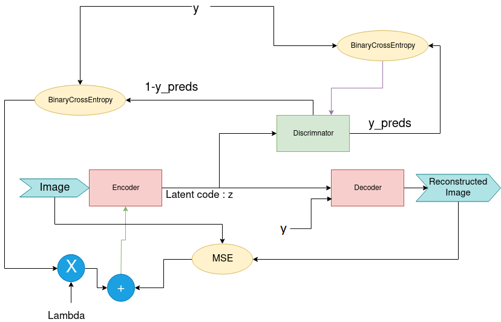
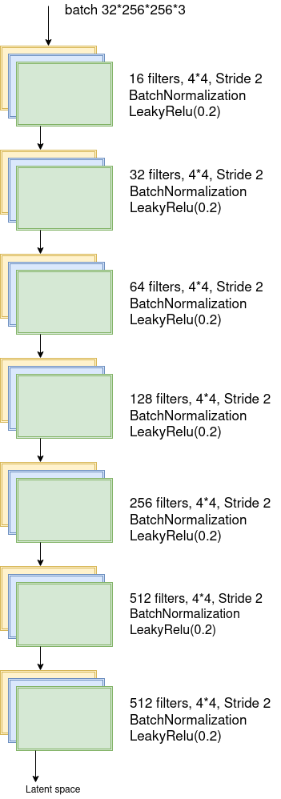
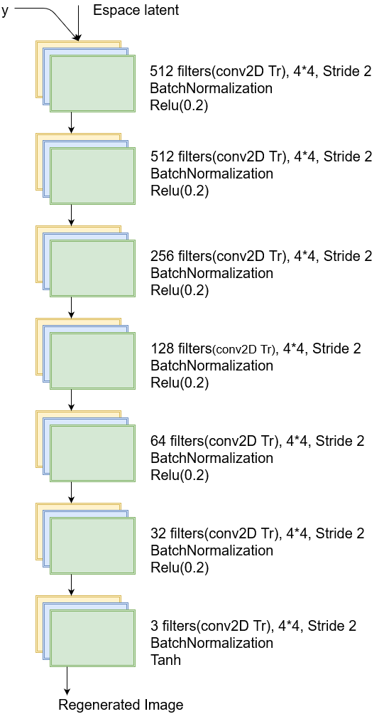
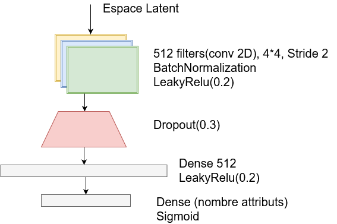
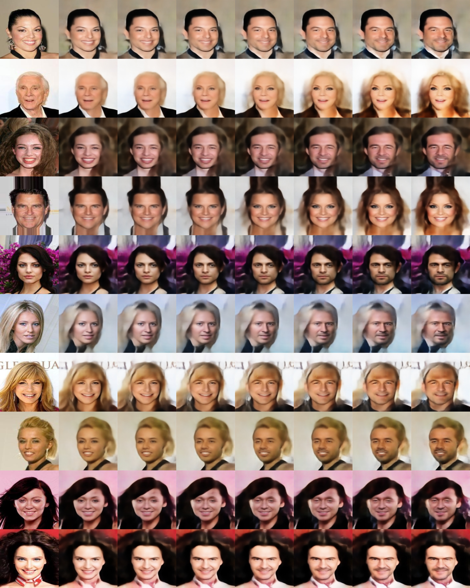
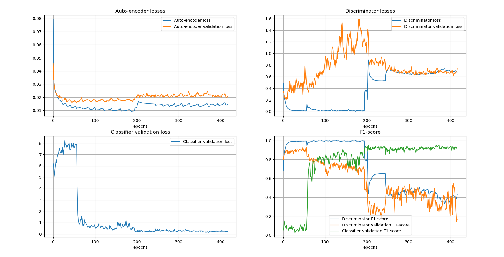

# FaderNetworks-with-Tensorflow
This repo presents our project for the machine learning course.
 
It was introduced by the authors Lample et al. (2017) who describes an encoder-decoder architecture allowing to reconstruct real images by modifying their attributes, i.e. gender, age, adding glasses and other modifications by extracting certain information from the image.  Like the original article, the model allows to significantly modify the perceived value while preserving the character.

Fader Networks are about manipulating natural images by controlling certain attributes of interest, that is, we generate different realistic versions of images by modifying image attributes such as gender or age group. They can exchange several attributes at once and continuously interpolate between each attribute value. For this purpose, using an encoder-decoder architecture that trained to reconstruct these images

Our approach is based on an encoder-decoder and discriminator architecture where, given an input image x with its attributes y, the encoder maps x to a latent representation z, and the decoder is trained to reconstruct x based on (z, y).

## Authors : 
- Youcef CHORFI
- Gontran GILLES
- Sara NAIT ATMAN
- Nathaniel DAHAN

## Dependencies
* Python 2/3 with [NumPy](http://www.numpy.org/)/[SciPy](https://www.scipy.org/)
* [Tensorflow](https://www.tensorflow.org/)
* Opencv
* CUDA 

## Fader Architecture
<p align="center"><a href=https://github.com/Youcef-11/FaderNetworks-TensorFlow/blob/master/results/FaderNetworks1.png?raw=true></a></p>

## Encoder Architecture
<p align="center"><a href=https://github.com/Youcef-11/FaderNetworks-TensorFlow/blob/master/results/Encoder_Diagram.png?raw=true></a></p>

## Decoder Architecture
<p align="center"><a href=https://github.com/Youcef-11/FaderNetworks-TensorFlow/blob/master/results/Decoder_Diagram.png?raw=true></a></p>

## Dicriminator Architecture
<p align="center"><a href=https://github.com/Youcef-11/FaderNetworks-TensorFlow/blob/master/results/Discriminateur_Diagram1.png?raw=true></a></p>


## Model Results
<p align="center"><a href=https://github.com/Youcef-11/FaderNetworks-TensorFlow/blob/master/results/results.jpg?raw=true></a></p>

## Model Stats
<p align="center"><a href=https://github.com/Youcef-11/FaderNetworks-TensorFlow/blob/master/results/loss.png?raw=true></a></p>


## Data
CelebA to be downloaded from
```
https://mmlab.ie.cuhk.edu.hk/projects/CelebA.html
```

## Training the classifier is only important for the training of fader network.
```
./classifier.py #to train the classifier
```

## Put the name of the trained classifier folder in params.yaml file
```
./fader_train.py #to train the fader
```

##  Put the name of the trained fader folder in params.yaml file
```
./main.py #to see results
```
